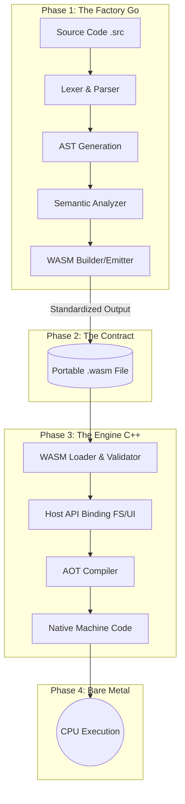

# Core Architecture & Execution Flow

This document outlines the foundational architecture of the language. The system is divided into two distinct components linked by a universal, unbreakable contract: WebAssembly (WASM).

By separating the **Frontend Compiler** (developer experience) from the **Execution Engine** (raw performance), we achieve a modern, secure, and hyper-portable ecosystem.

---

## 1. High-Level Pipeline

The pipeline follows a strict "Source -> Universal Bytecode -> Native Code" architecture.


---

## 2. Component Breakdown

### Part A: The Frontend Compiler (Written in Go)
The compiler is purely a text-processing engine. It does not know or care about the physical hardware it runs on or the hardware the code will eventually target. 

*   **Speed & Concurrency:** Go handles thousands of files simultaneously via Goroutines, providing instant compilation times for the developer.
*   **The Flow:**
    1.  **Lexer/Parser:** Converts human-readable text into tokens, then into an Abstract Syntax Tree (AST).
    2.  **Semantic Analysis:** Checks types, variable scopes, and logic errors.
    3.  **WASM Generation (Builder):** Traverses the AST and emits flat, stack-based WebAssembly instructions using the official WASM binary specification.

### Part B: The Universal Bytecode (WASM Spec)
The `.wasm` file acts as the boundary between human intent and machine execution.
*   **Agnostic:** Contains no assumptions about CPU registers or OS-specific memory allocation.
*   **Secure:** Formally verified stack-machine format allows the engine to validate safety in a single pass before execution.
*   **Portable:** A single `.wasm` file compiled on an M1 Mac will run flawlessly on an x86 Linux server.

### Part C: The Execution Engine (Written in C++)
This is a standalone, hyper-optimized runner. It acts as a micro-Operating System for the bytecode.
*   **Raw Speed:** Written in C++ to tightly manage memory and speak directly to hardware.
*   **The Flow:**
    1.  **Loader/Validator:** Reads the `.wasm` file and mathematically proves it is safe (no illegal memory jumps).
    2.  **Host API Injection:** Binds custom C++ functions (Filesystem access, OpenGL/Vulkan rendering) to the WASM sandbox so the bytecode can interface with the real world safely.
    3.  **AOT Compiler:** Aggressively translates the generic stack-based WASM into raw, register-based machine code optimized for the exact physical CPU it is running on.
    4.  **Execution:** Points the CPU to the generated machine code and hits run.

---

## 3. Memory & Sandboxing Model

To ensure absolute security and predictable performance, the engine utilizes a **Linear Memory Model**.

1.  The C++ Engine allocates a single, contiguous block of raw memory (an array of bytes).
2.  The compiled `.wasm` bytecode is locked inside this array. It cannot mathematically read or write to any memory address outside of this assigned block.
3.  All complex data structures (strings, objects, arrays) are mapped as raw byte offsets within this linear memory space.

---

## 4. The Developer Experience

From the user's perspective, the complexity of the Go-to-C++ pipeline is entirely hidden. The daily workflow looks like this:

**1. Compile the code:**
```bash
# Triggers the Go frontend. Takes milliseconds.
$ mylang build main.src -o output.wasm
```

**2. Run the code:**
```bash
# Triggers the C++ engine. AOT compiles and executes instantly.
$ mylang run output.wasm
```
